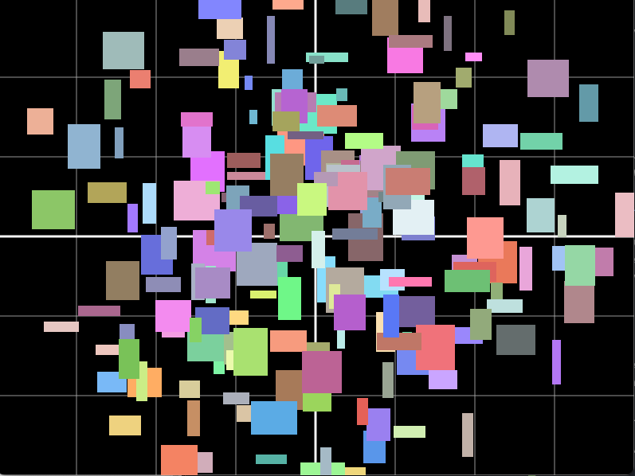
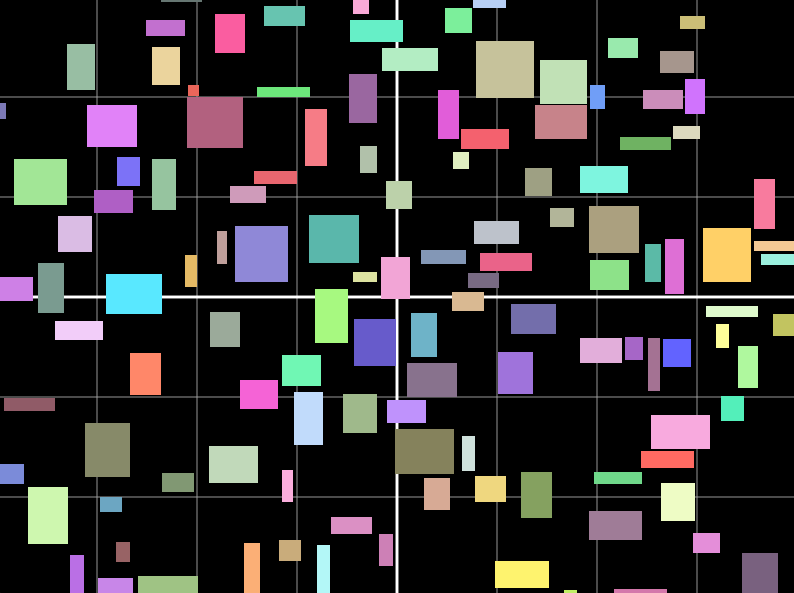

## Introduction
TL/DR: Go-Shapes is a "proto-game", It showcases networked multi-player game-development with a simple simulation and player
input to alter game state.

- A client/server proto-game written in Go (https://go.dev).
- Uses gRPC (google proto-buffers) as message and interchange format between client and server (https://grpc.io/).
- Built around Ebitengine game-framework (https://ebitengine.org/)
- A simple simulation is run and a single player input is taken (see demo below).
- Supports many clients (100s) connected to one server on a modern laptop.
- Performance tuning and bottle-neck analysis can be made using a load-test script spawning many headless-clients. 
- Some interesting timing figures are shown by the server when executing.

Otherwise, it is a pretty naive game-loop and simulation using the actor pattern.

The project is organized by programming language, as it could serve as a demonstration for using different client-side
technology compared to the server side. For example, a Unity-client and Go based server. There is a deprecated Python
client under the /deprecated sub-directory.

Would probably re-factor this into an ECS design if moving forward with some more fun.

## Demo
The proto-game (or "game") initially draws a number of shapes (colored rectangles) at coordinate 0,0. 

The simulation then drives the "AI" for each box. Each box will, if colliding with any other box, move a random number of pixels. This
continues until settled (no collision). If colliding again - move again, and so forth. So initially, all boxes are
colliding and will sort of "self-arrange" until no box over-laps.

The player (you) then controls a single box as well using the mouse. If that player-controlled box
is moved to overlap any box, that box will move to the center and if overlapping the boxes will try to re-arrange to
create a non-overlapping state.

Easiest way to see it in action (after the first-time setup, described below) is to go into the gui-client directory:

    $ go run main.go --localsim

To start a local simulation.

## Structure
Before setting things up, it is worth knowing the game is structured around a few modules:

- A shared game core library (wtf-main/lib).
- A server binary.
- A GUI client binary.
- A headless client binary.

Due to this structure, the game can be run in a few different ways:

- The server can of course be started with 0 clients connected (its a headless console application).
- Client only: The client binary can be run with a flag to run the simulation embedeed inside the client.
- Server only (that is just the server with 0 clients).
- Server with clients connected via TCP or WebSockets.

There is both a GUI client (window showing the "game") and a headless client, just running the simulation.

The client can also be deployed as a WASM (WebAssembly) application connecting to a server by web-sockets.

## Basic Setup
Follow instructions over att https://go.dev to get your basic Go environment  installed

MAC:

    brew install golang@1.24.3

Ubuntu:

    apt-get install golang

Add this to your whatever is your shell init file

    export GOPATH=$HOME/go
    export PATH=$PATH:$GOPATH/bin

And source it, or re-launch your shell. Head over back here and do:

    go mod download

This will also install the protobuf/capnproto libraries needed for the stub generation of the common directory.

To update all modules, do

    go get -u
    go mod tidy
    

## Development Run

### Local client only

    $ go run gui-client/main.go --localsim

### Gui client vs. local dev server
First start the local server:

    $ go run server/main.go -p wss

Then connect a local client using secure web-socket protocol (wss):

    $ go run gui-client/main.go -h localhost -p wss

## Build
For complex build examples, see the .
